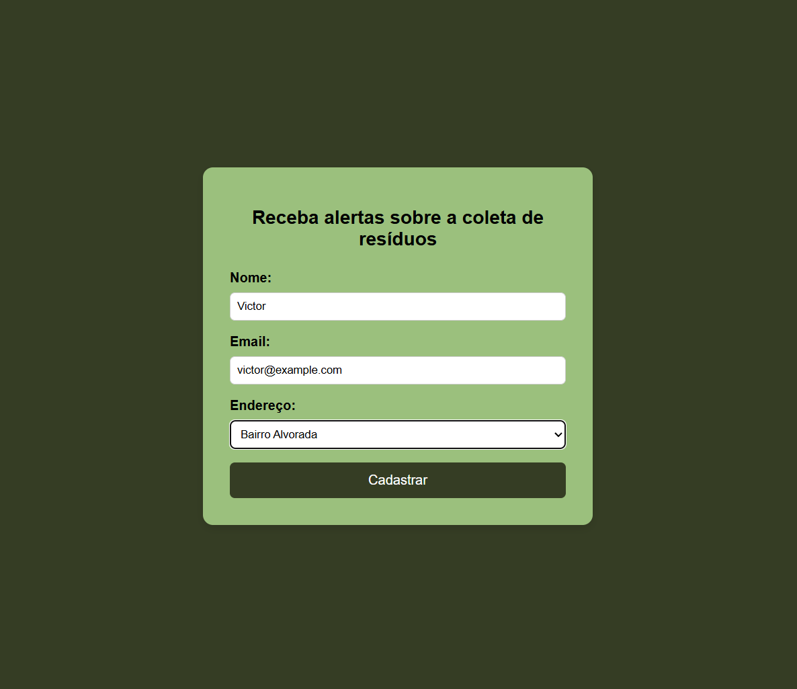
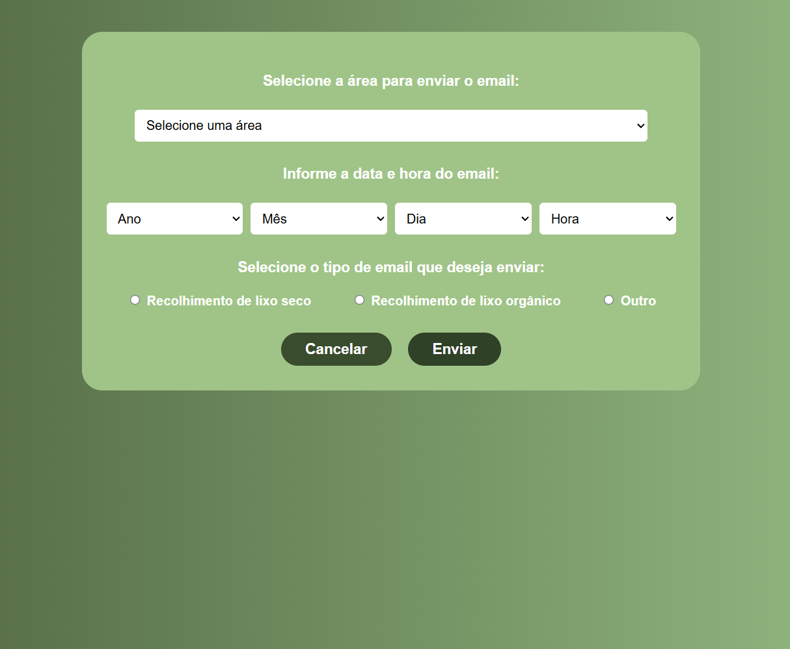
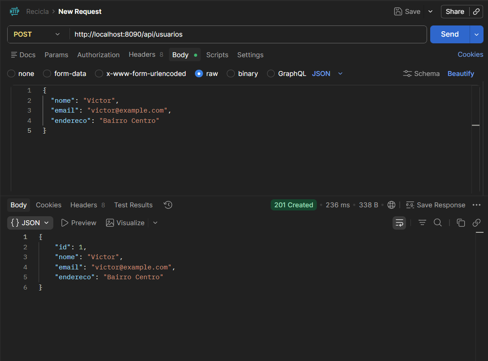
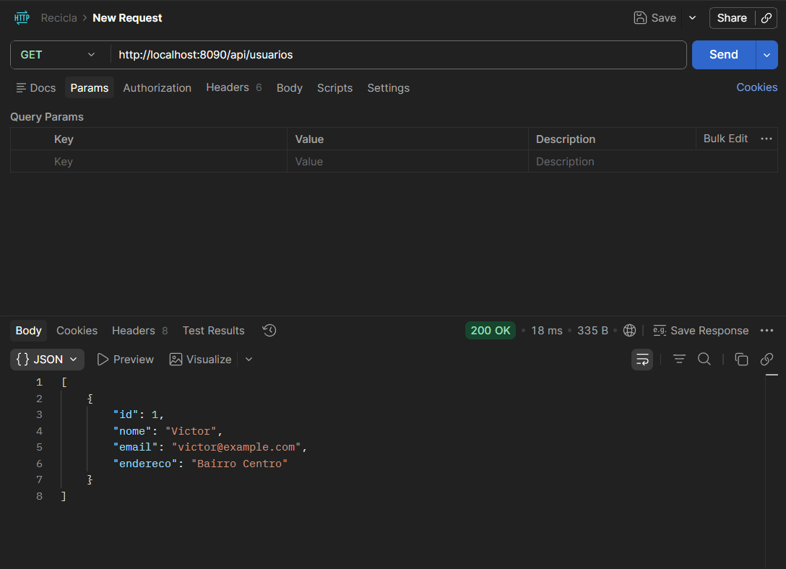
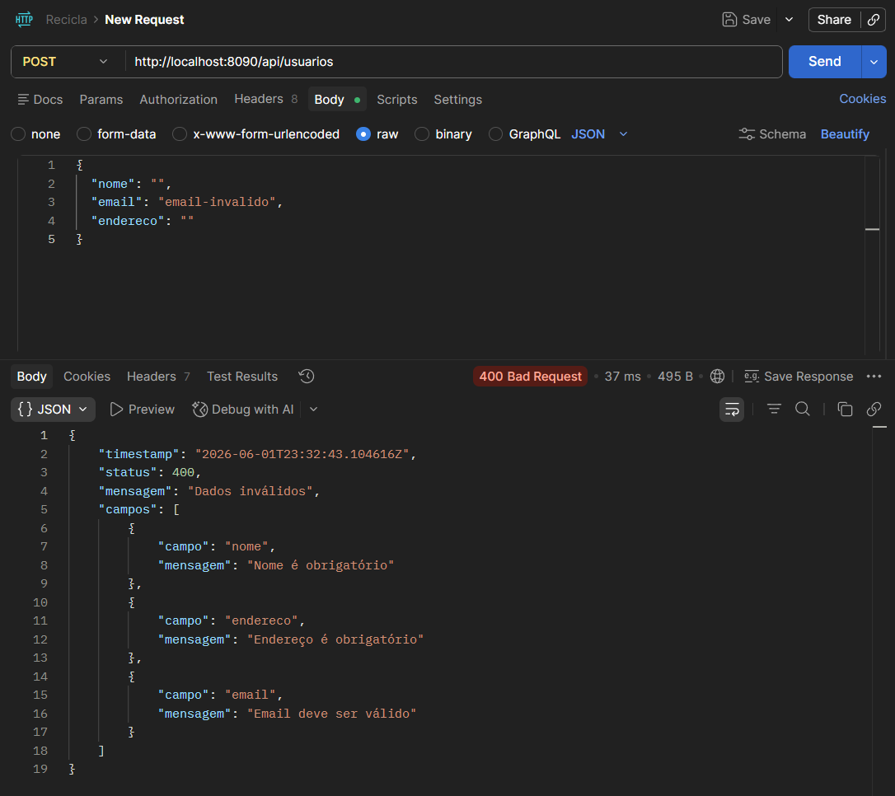
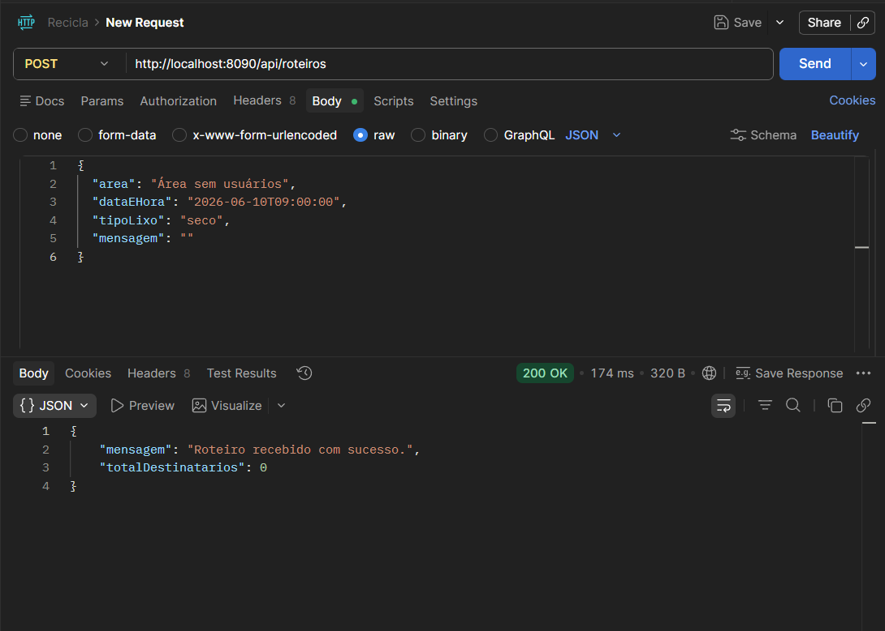
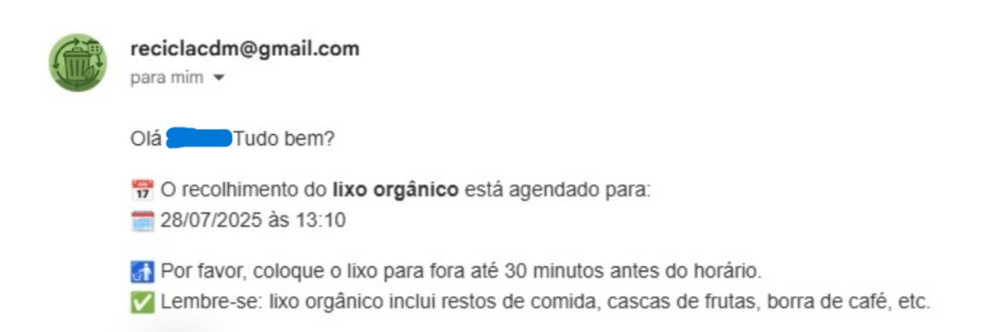
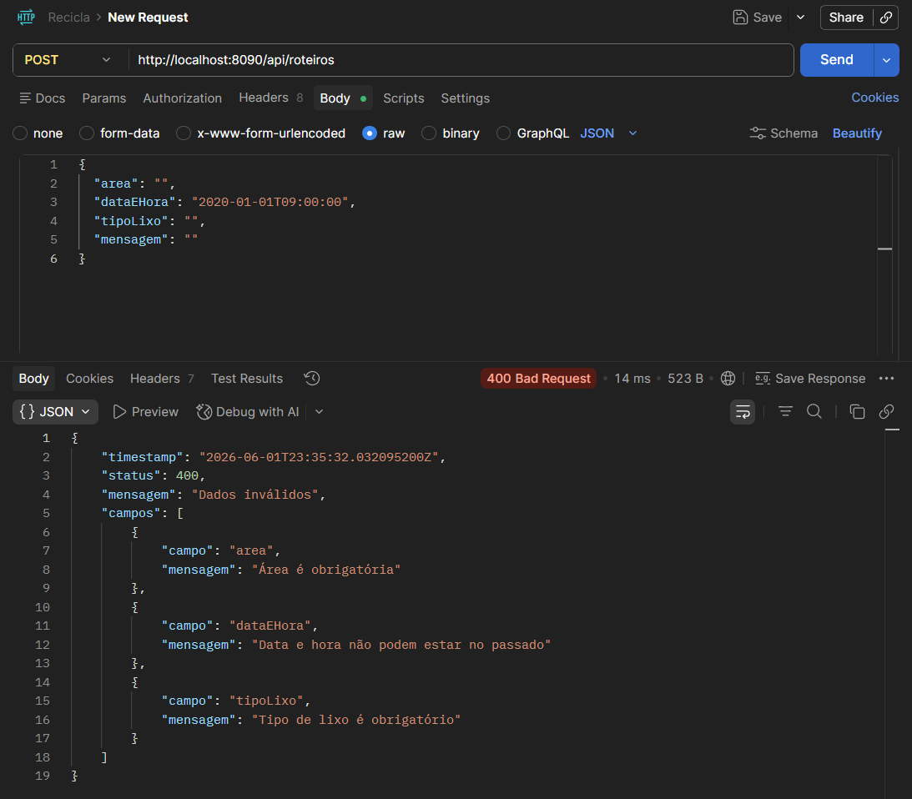
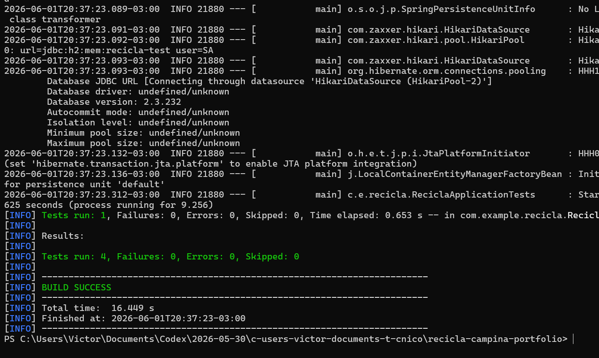

# Recicla Campina

O Recicla Campina é um projeto que desenvolvi para ajudar na comunicação sobre a coleta de resíduos. A ideia é simples: o morador se cadastra com nome, email e endereço, e a administração consegue enviar alertas de coleta para uma região específica.

Com esse projeto, conquistei o 1º lugar na Feira do Conhecimento 2025 da Escola João XXIII, na categoria do Ensino Médio.

Esse projeto nasceu como um exercício técnico, mas eu revisitei a base para deixar a API mais organizada, segura e próxima de um projeto real de portfólio.

## O que o sistema faz

- Cadastra moradores interessados em receber alertas de coleta.
- Lista os moradores cadastrados.
- Permite criar um roteiro de coleta por área, data, horário e tipo de resíduo.
- Envia alertas por email para os usuários encontrados naquela região.
- Usa SMTP com credenciais configuradas por variáveis de ambiente.
- Valida os dados recebidos pela API antes de salvar ou processar.
- Retorna mensagens de erro em um formato mais organizado.
- Possui testes automatizados para os principais fluxos da API.

## Demonstração

### Tela de cadastro do morador



### Painel administrativo



### Cadastro de usuário pela API



### Usuário salvo no banco



### Validação de usuário



### Criação de roteiro



### Email de alerta recebido



### Validação de roteiro



### Testes automatizados



## Tecnologias usadas

- Java 17
- Spring Boot 3
- Spring Web
- Spring Data JPA
- Jakarta Validation
- PostgreSQL
- H2 para testes automatizados
- HTML, CSS e JavaScript
- Docker Compose para subir o banco local

## Estrutura principal

```text
src/main/java/com/example/recicla
├── Controller
├── Entity
├── Repository
├── Service
└── ReciclaApplication.java
```

O backend segue uma organização simples em camadas:

- `Controller`: recebe as requisições HTTP.
- `Service`: concentra as regras de negócio.
- `Repository`: faz o acesso ao banco.
- `Entity`: representa os dados usados pela aplicação.

## Como rodar o projeto

Primeiro, suba o PostgreSQL com Docker:

```bash
docker compose up -d
```

Depois, configure as variáveis de ambiente. O arquivo `.env.example` mostra quais valores são necessários.

No PowerShell:

```powershell
$env:DATABASE_URL="jdbc:postgresql://localhost:5432/recicla"
$env:DATABASE_USERNAME="postgres"
$env:DATABASE_PASSWORD="sua-senha-do-postgres"
$env:MAIL_USERNAME="seu-email@gmail.com"
$env:MAIL_PASSWORD="sua-senha-de-app"
$env:MAIL_FROM="seu-email@gmail.com"
.\mvnw.cmd spring-boot:run
```

Por padrão, a API fica disponível em:

```text
http://localhost:8090
```

## Endpoints da API

### Cadastrar usuário

```http
POST /api/usuarios
Content-Type: application/json
```

Exemplo:

```json
{
  "nome": "Victor",
  "email": "victor@example.com",
  "endereco": "Bairro Centro"
}
```

Resposta esperada:

```json
{
  "id": 1,
  "nome": "Victor",
  "email": "victor@example.com",
  "endereco": "Bairro Centro"
}
```

### Listar usuários

```http
GET /api/usuarios
```

### Criar roteiro de coleta

```http
POST /api/roteiros
Content-Type: application/json
```

Exemplo:

```json
{
  "area": "Bairro Centro",
  "dataEHora": "2026-06-10T09:00:00",
  "tipoLixo": "seco",
  "mensagem": ""
}
```

Resposta esperada:

```json
{
  "mensagem": "Roteiro recebido com sucesso.",
  "totalDestinatarios": 3
}
```

## Exemplo de erro de validação

Se algum campo obrigatório for enviado vazio ou inválido, a API responde com status `400 Bad Request`.

```json
{
  "timestamp": "2026-05-30T23:00:00Z",
  "status": 400,
  "mensagem": "Dados inválidos",
  "campos": [
    {
      "campo": "email",
      "mensagem": "Email deve ser válido"
    }
  ]
}
```

## Testes

Para rodar os testes:

```bash
./mvnw test
```

No Windows:

```powershell
.\mvnw.cmd test
```

Os testes usam H2 em memória, então não dependem do PostgreSQL local.

## Segurança

As credenciais de banco e email não ficam no código. A aplicação usa variáveis de ambiente para receber essas informações.

Antes de publicar o projeto, é importante garantir que nenhuma senha real tenha sido enviada para o repositório.

## Status atual

- API compilando.
- Testes automatizados passando.
- Configuração local documentada.
- Segredos removidos do arquivo principal de configuração.
- Front simples incluído no projeto.

## Próximos passos

- Criar autenticação para proteger o painel administrativo.
- Melhorar a tela do administrador e a tela do usuário.
- Salvar histórico dos roteiros enviados.
- Permitir cadastro e edição das áreas pelo administrador.
- Criar templates de email mais bonitos.
- Publicar a API em um ambiente online.

## Observação

Esse projeto ainda pode evoluir bastante, principalmente na parte visual e na autenticação. Mesmo assim, a base da API já está organizada para ser apresentada como projeto de portfólio e continuar recebendo melhorias.
